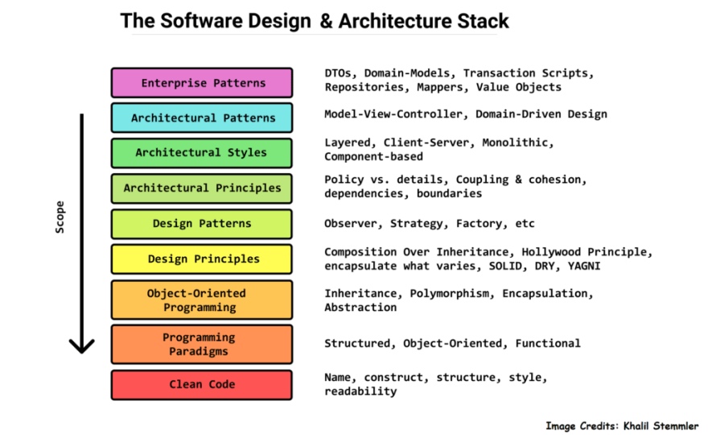

<h2 id = "overview">Again And Again</h2>
You'll begin to recognize as you code more often repeating strategies used time and time again. They might not be connected in any way, yet the structure of the code you write tends to be the same. These are known as design patterns. Design patterns are reusable approaches to addressing a typical issue that arises when creating an application. It provides a model or explanation on how to address the issue. These routines are designed to increase productivity and save time similar to a recursive function.
<h2 id = "Approach"> Design Patterns In Action </h2>
"Observer" is a design pattern example, where an object is thought to be one that automatically updates the state and alerts dependents while preserving the list. This design pattern enables the integration of the process and the comprehension of what will happen next, how things are updated, and the necessary sequential sequence. Our teams final project is an example of this design pattern. This was made clear by the way that subscribers and publishers, who represented the roles of observer It was possible for us to subscribe to publications that drew data from MongoDB collections and updated it when changes were made. If a student wanted to see the recipes that were available, we would publish the Recipe collection on the server side and then subscribe on the client side.

<h2 id = "basics"> Programmers are Lazy </h2>
Aren't all of us programmers lazy and just hoping to find something that helps us cut down our project times? Design Patterns do just that. As long as we know how to use them, they allow for us to create applications while cutting down time and effort which is why understanding them is important.

