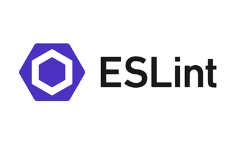

<h2 id="So Many Errors">So Many Errors</h2>
Before getting into coding standards, I didn’t know there was a wider range of coding standards other than naming variables likeThis and semicolons are completed lines. After learning more about coding standards through this module, I realized how I overlooked these basic yet important standards. Coding standards are important not just for an individual programmer but for collaborative efforts as well. Following coding standards makes it easier for you to find errors and when working with others, it makes code easier to read and understand.

<h2 id="ESLint, Yay or Nay?">ESLint, Yay or Nay</h2>
In this course, we’ve been playing around with ESLint and IntelliJ for about a week or so now. First impressions of ESLint were not good. I had a lot of difficulties setting it up to run properly on IntelliJ, although this could’ve just been a me thing with following the given instructions. It took me a couple times to get ESLint running properly and after that the experience got better. To be honest, I’m a messy programmer and ESLint helped correct my messiness and showed me how clean code is supposed to look. One thing I didn’t like about ESLint however is the fact that it’s super picky with errors. For example I could create a function and it’ll tell me that the function isn’t used yet even though I just created it, same with variables. This isn’t a huge deal however it just bothers me personally.

<h2 id="Conclusion">Conclusion</h2>
In conclusion Even though I had a rough start with ESLint, I actually enjoy having this tool in my coding arsenal. It helps me keep my code clean and organized and points out errors that I may have not caught on my own. If it makes my job easier while programming, I’ll take it even though it may come with some annoying features that I’m not fond of.

