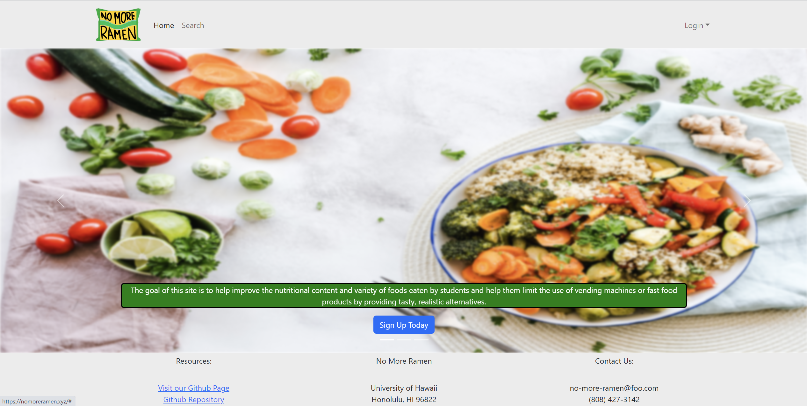
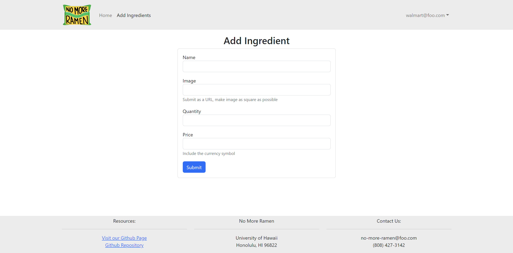

<h2 id="About">About</h2>

College students typically have a tight budget and few cooking supplies. Students consequently eat fast food items or vending machine snacks.
This website seeks to increase the variety and nutritional value of the foods consumed by students. This website application assists merchants in marketing their ingredients while enabling students to find and share recipes that fit within a student budget. You can post recipes for other students to see as a student. You can use the site's search feature to narrow down the recipes you see based on your dietary needs, preferred serving size, etc. Additionally, you can conduct a search for any necessary ingredients and identify the supplier to buy them from. You can add ingredients that you sell as a merchant, together with information about their price and quantity on hand.

<h2 id="About">Contributions</h2>
For this group project, I was in charge of creating the landing page where users are directed when they first type in the URL and I was also in charge of the "Add Ingredients" page for vendors where vendors could add ingredients that they had on hand.This project taught me a lot about web development. I was able to create a user-friendly user interface on the front end that received data from a user and provided it back to the server. The information was then presented in an understandable fashion. I was able to keep student and vendor data in MongoDB on the backend and send it as needed to the frontend.

  
  

