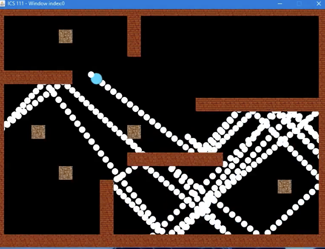
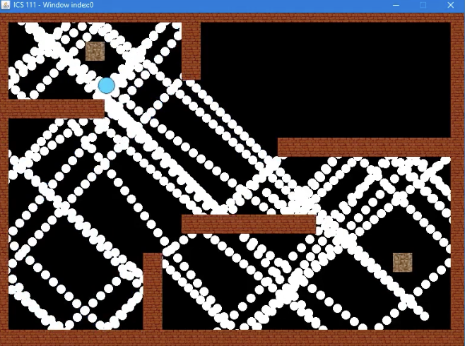
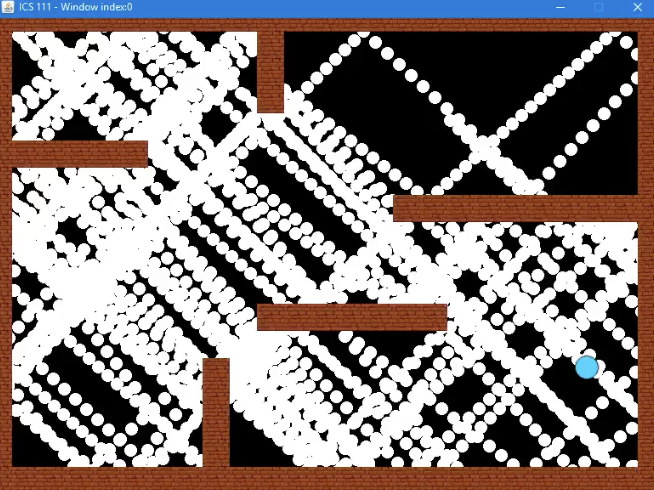

<div class="text-center p-4">
  
  
  
</div>

<h2 id="Introduction">Introduction</h2>
In ICS 111, this was a solo project that needed to be finished. The game's goal was to familiarize us with object-oriented programming. It enabled us to use numerous classes and methods and include them into a simple program that would run on its own.

<h2 id="About">About</h2>

Given a range of x and y locations, the project generates an object that automatically moves around the screen. It must remain inside the confines of the screen and avoid colliding with any of the established walls and borders. I had to learn how to use object-orienation and the EZ Java library for the development.

<h2 id="learning-outcomes">Learning Outcomes</h2>

Through this project, I improved my object-orientation skills and learned how to code independently. I learned more about program functions and arguments as a result. By developing my own programming skills and implementing methods and functions, I was able to learn how to use object-oriented programming to solve problems recursively and to code backwards.
```
