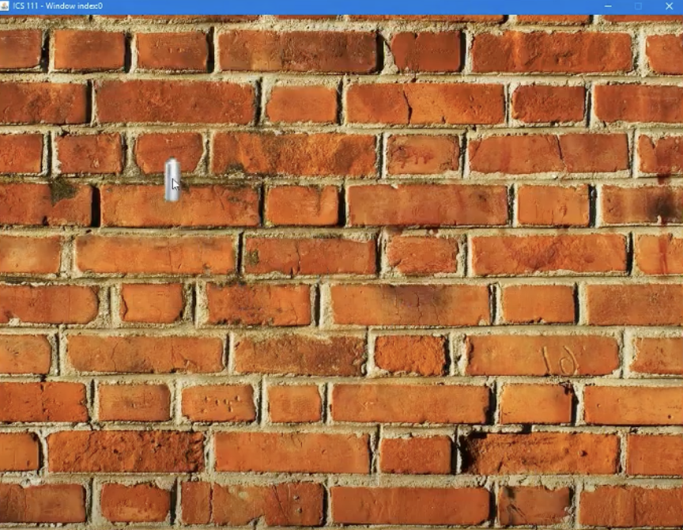
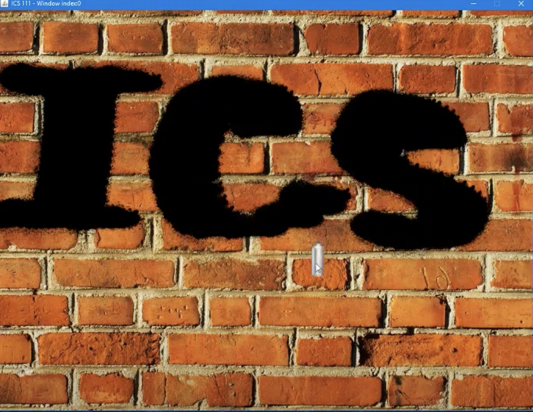
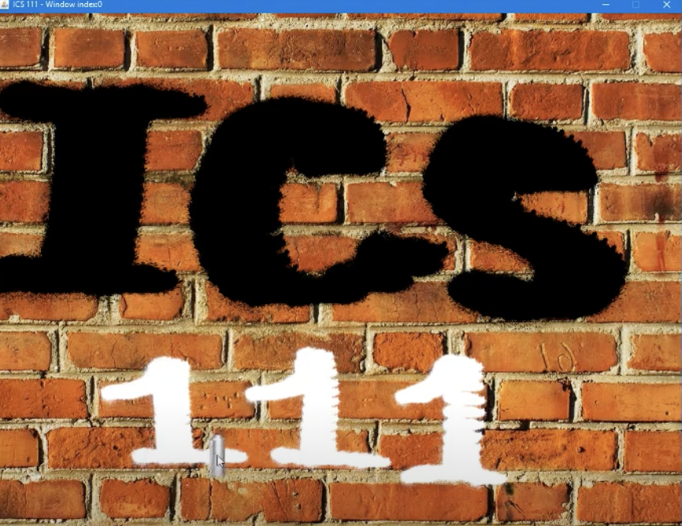

<div class="text-center p-4">
  
  
  
</div>

<h2 id="Introduction">Introduction</h2>
For our final project me and my partner decided to recreate the famous "Bricker Breaker game using Java and a class known as "EZ.java" 

<h2 id="About">About</h2>

The game is simply, break the bricks with the ball and earn powerups such as double or triple the balls when certain bricks were broken. The game gave you three lives and kept track of high scores. For this project, I developed the movement of the ball, controls for the paddle, and the graphics.

<h2 id="learning-outcomes">Learning Outcomes</h2>

This was my first programming class I took so it was moderately difficult in terms of programming. I learned how to collaborate with another person to achieve the end product. This program also helped me better grasp the main concept of Java which is Object Orientated Programming.
```
